Sparips Tutorial
=====

## Persistent homology of Rips complexes

Persistent homology describes how topological features vary as a single parameter changes.  
Suppose we have a dataset of points, and a distance function. The persistent homology of its Rips-complex describes how the topological features of this pointcloud change, as we zoom in or out, i.e. for the "scale" parameter.  
Persistence has good stability / continuity properties. For Rips-complexes of point-clouds, this means that similar point-clouds have similar persistence diagrams, where "similar point-cloud" means small Gromov-Hausdorff distance. In practice, this means that we can perturb data-points, or take sufficiently dense subsamples without massively changing the persistence diagram. Especially, it is possible to compute approximate persistence diagrams of infinite but compact metric spaces by taking only a finite number of sample points (tending to infinity as we increase the desired precision of the approximation). Persistence diagrams and their approximations will be explained later.

The Rips complex at scale `r` simply contains all edges of lengths smaller `r`. So the topology will always evolve from a bunch of isolated points for very small `r`, towards a single point at very large `r` (a complete graph can be contracted to a point), and in between interesting stuff happens. 

The standard tool for computing persistent homology is `ripser`, which takes a distance matrix and outputs a list of topological features and their scales. The simplest feature of `Sparips.jl` is to assemble of the distance matrix from a set of points and a distance function, calls `ripser`, parses the output into a julia structure and can optionally plot the diagrams. The more interesting feature of `Sparips.jl` is to assemble a sparsified distance matrix, given a prescribed precision of approximation. The resulting persistence diagram is then guaranteed to approximate the true diagram of the finite point-cloud, up to that precision. Then, when plotting, we also visualize error bars incurred by the approximation, in order to clearly distinguish what we actually resolved.

The reason for sparsification is the following: `ripser` is the current performance king of the hill in the linear algebra task of computing persistence:  k-dimensional persistent homology typically runs in linear time and memory in the number of k-simplices, for `k>0`. However, given N sample points, there are `~N^(k+1)` such simplices (`2^N` for unbounded `k`). From this scaling, it is clear that only tiny datasets are amenable to topological data analysis using `ripser` for `k >1`. For intrinsically low-dimensional datasets, `Sparips.jl` reduces this number to linear `O(N)`. 

Exponential-to-linear sounds like a very impressive gain in complexity class. In the real world, this gain is hard to realize, because we often hit limitations of hardware and internal limitations of `ripser` long before we enter the asymptotic regime. For this reason, application of `Sparips.jl` often needs a little bit of exploratory tuning of parameters in order to analyze datasets to acceptable approximation bounds while using acceptable amounts of time and memory.

This tutorial walks through an example and showcases the implemented features of `Sparips.jl` and the opportunities for trade-offs.


## Preparation
We first need to load all necessary packages.


```julia
using Distances, StaticArrays, Random, Plots, Sparips
Random.seed!(23);
Plots.default(fmt=:png);
```

In order to build ripser, if not already done, we can run


```julia
import Pkg
Pkg.build("Sparips");
```

## Example: Twice-wound Torus and Solenoid

Our main example will be a two dimensional torus embedded in `R^3` that winds around the `z`-axis twice.


```julia
function sample_solenoid(phi=rand(), x=rand(), y=rand(), n=30)
    x = 3.0*x
    y = 3.0*y
    bs = 2.0^(-45)
    for i=1:n
        x = x/3 + cos(2*pi*phi)
        y = y/3 + sin(2*pi*phi)
        phi = (2*phi + bs*rand()) % 1.0
    end
    x = x/3.0
    y=y/3.0
    return SVector{3,Float32}(cos(2*pi*phi)*(x+1.0), sin(2*pi*phi)*(x+1.0), 0.7*y)
end

function regular_torus(nmall, nlarge)
    res = Vector{SVector{3, Float32}}();
    for phi in range(0.0, stop=1.0*(nlarge-1)/nlarge, length=nlarge)
        for psi in range(0.0, stop=2*pi*(nmall-1)/nmall, length=nmall)
            x= 0.4*cos(psi)
            y= 0.4*sin(psi)
            push!(res, sample_solenoid(phi, x, y , 1)) 
        end
    end
    res
end

tinytorus = regular_torus(6, 160)
mediumtorus = regular_torus(12, 320)

function gensolenoid(N, r=0.5, n=20)
    pts = [sample_solenoid(rand(), (r .*sincos(rand()*2*pi))... , n) for i=1:N]
    return pts 
end 

largetorus = gensolenoid(100_000, 0.4, 1);
```

Let's take a look at the dataset:


```julia
datamat=reshape(reinterpret(Float32, tinytorus), (3,length(tinytorus)));
p1= plot(datamat[1,:], datamat[2,:], datamat[3,:]; seriestype=:path, 
    legend=false);
p2=plot(datamat[1,:], datamat[2,:]; seriestype=:path,
    legend=false, xlabel="x", ylabel="y");
p3=plot(datamat[1,:], datamat[3,:]; seriestype=:path,
    legend=false, xlabel="x", ylabel="z");
plot(p1,p2,p3)
```


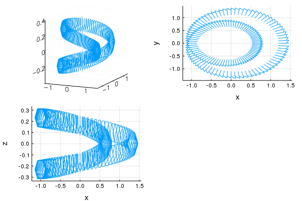


## Computing Barcodes
Now let us compute the barcodes of this set. We first assemble the edges, without any sparsification.


```julia
#organize as tree. Some permutations are bad, so we better shuffle the data.
ct_tiny = Ctree(shuffle(tinytorus));
#assemble edges, up to precision `1.0f0`, i.e. without any sparsification
#using up to -1 points (i.e. all of them)
#using the default sparsification strategy
edges_tiny_full = sparsify_ctree(ct_tiny, 1.0f0, -1; strategy=APriori());
```

We can now compute the persistence diagrams. This takes a little while and may fail if we have insufficient memory! We start with homology over Z2:


```julia
tinyz2full_time_d1 = @elapsed @time tinypers_z2d1 = runrips(edges_tiny_full; dim = 1);
@show length.(tinypers_z2d1.bars), tinypers_z2d1.dimscomplete;
```

     28.996076 seconds (8.18 M allocations: 249.984 MiB, 0.36% gc time)
    (length.(tinypers_z2d1.bars), tinypers_z2d1.dimscomplete) = ([960, 1056], 2)


```julia
@time tinypers_z3d1 = runrips(edges_tiny_full; dim = 1, modulus = 3);
@show length.(tinypers_z3d1.bars), tinypers_z3d1.dimscomplete;
```

     31.037775 seconds (6.86 M allocations: 183.803 MiB, 0.19% gc time)
    (length.(tinypers_z3d1.bars), tinypers_z3d1.dimscomplete) = ([960, 1056], 2)


The `dimscomplete` is for the case that `ripser` runs out of memory: If `dimscomplete == length(bars)` then the last dimension with any output was completed, otherwise it contains partial results. 

Computing persistence in Z2 and up to dimension `1` is the default (but we could have been explicit with `modulus = 2`). Ripser does not permit computation of integral homology, so we have to make do with rerunning the computation in different fields

In this example, we can tell beforehand what to expect: There are, in principle, three one-dimensional homology classes we expect: We can wind around the small dimension of the torus; this homology class persists from the sampling resolution until the small dimension collapses, and we have a mostly one-dimensional object. We can wind around the large dimension of the torus, which winds around the `z`-axis twice; and we can wind around the `z`-axis once, if the scale is large enough that we can make the jump across the two windings. In Z2, where twice is nothing, we will see the homology class corresponding to the large torus dimension vanish, and a new homology class appear to take its place. In Z3, on the other hand, the same class persists.

Let us verify this prediction. The result `mediumpers_z2d1` has a field `bars`, which is a vector of results for each dimension; and each dimension is a vector of tuples of floating point values, signifying the birth and death of their homology class. We are interested in the classes with the largest quotient, i.e.~the longest logarithmic lifetime:


```julia
sort(tinypers_z2d1.bars[2]; by=t->t[1]/t[2])[1:7]
```


    7-element Array{Tuple{Float64,Float64},1}:
     (0.0946581, 0.40718)
     (0.291378, 1.18423) 
     (0.133333, 0.206886)
     (0.110299, 0.169483)
     (0.104775, 0.149713)
     (0.104775, 0.149713)
     (0.10517, 0.149856) 


```julia
sort(tinypers_z3d1.bars[2]; by=t->t[1]/t[2])[1:7]
```


    7-element Array{Tuple{Float64,Float64},1}:
     (0.0946581, 1.18423)
     (0.133333, 0.206886)
     (0.110299, 0.169483)
     (0.104775, 0.149713)
     (0.104775, 0.149713)
     (0.10517, 0.149856) 
     (0.10517, 0.149856) 


We can see the effect of the chosen finite field quite nicely. Considering that we already expect a specific result, we can guess at the homology class corresponding to the small torus dimension. However, this is not really convincing: The scale is just too close to the sampling resultion. If this were real data where we did not know the result before, then the small torus dimension would be impossible to discern. If this were real data where we had pet theory about the results beforehand, we would run into danger of inadvertently tweaking the result until it matches our preconception.

This kind of result is best visualized in a persistence diagram. Such a diagram simply draws a dot for every homology class, in the birth-death plane. Let us look at the diagrams for one-dimensional homology:


```julia
tinypers_z2d1_plts = plotpers(tinypers_z2d1; filter=nothing);
tinypers_z3d1_plts = plotpers(tinypers_z3d1; filter=nothing);
tinypers_z2d1_plts_log = plotpers(tinypers_z2d1; filter=nothing, logscale=true);
tinypers_z3d1_plts_log = plotpers(tinypers_z3d1; filter=nothing, logscale=true);
p1=tinypers_z2d1_plts[2]
p2=tinypers_z2d1_plts_log[2]
p3=tinypers_z3d1_plts[2]
p4=tinypers_z3d1_plts_log[2]
title!(p1, "Z2d1")
title!(p2, "Z2d1_log")
title!(p3, "Z3d1")
title!(p4, "Z3d1_log")


plot(p2,p1,p4,p3;
    layout=(2,2))

```


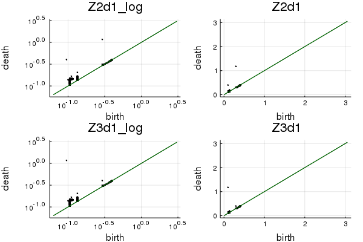


The torus carries two-dimension homology. Computing this takes quite some time.


```julia
tinyz2full_time_d2 = @elapsed @time tinypers_z2d2 = runrips(edges_tiny_full; dim = 2);
@show length.(tinypers_z2d2.bars), tinypers_z2d2.dimscomplete;
```

    204.886390 seconds (6.86 M allocations: 183.467 MiB, 0.02% gc time)
    (length.(tinypers_z2d2.bars), tinypers_z2d2.dimscomplete) = ([960, 1056, 112], 3)


```julia
sort(tinypers_z2d2.bars[3]; by=t->t[1]/t[2])[1:3]
```


    3-element Array{Tuple{Float64,Float64},1}:
     (0.169483, 0.20955) 
     (0.317725, 0.332878)
     (1.19524, 1.21666)  


```julia
plotpers(tinypers_z2d2; filter=nothing, logscale=true)[3]
```


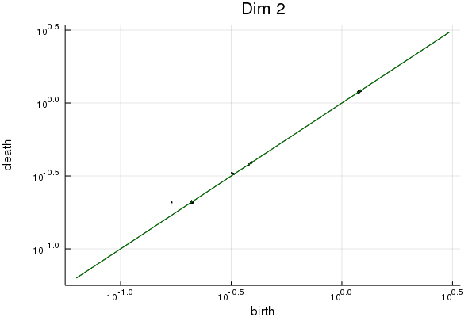


This computation took ~4 minutes and peak memory of ~10GB of RAM (not displayed because consumed by an external process) for a measly 960 sample points, which is, from a certain point of view, ridiculously bad. It is noteworthy that `ripser` should not be run with swap enabled: `ripser` truly uses *random* access memory, and it is generally better to crash early on an out-of-memory error and tweak parameters or run on a larger machine (this is also true for SSD-backed swap memory).

On the other hand, `ripser` computed the rank of a sparse matrix with `960*959*958/6` columns, i.e. 150 million simplices, and 150 billion nonzero entries. This is, from a certain point of view, rather impressive.


## The case for sparsification
Let us look at the source of this performance problem: Clearly, we have two many simplices. Let's see which edges are problematic:


```julia
rs = sort(collect(e[3] for e in edges_tiny_full.edges); rev=true);
p_rs=plot(rs[1:end], length(rs):-1:1; xaxis=:log, yaxis=:log, 
    xlabel="scale", ylabel="#edges", xflip=true, fmt=:png)
```


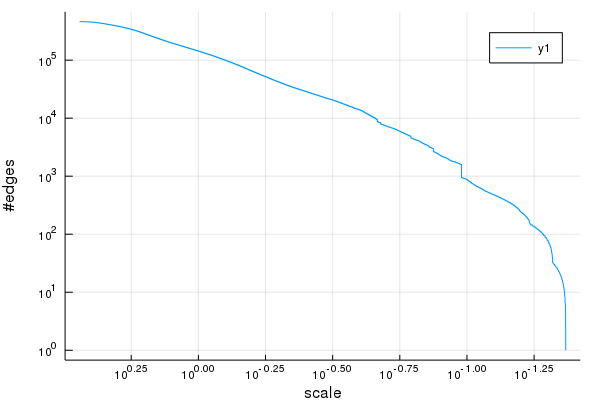


What we observe is that almost the entirety of our half million edges is spent on very large scales, while we are actually more interested in finer scales. This is wasteful.
    
On the other hand, the results will typically be imprecise anyway. This has two reasons: Firstly, robustness is the most attractive feature of topological data analysis; if we don't need robustness, then TDA is likely the wrong tool. Secondly, we are typically interested in an underlying infinite set, like e.g. the support of a distribution, or in our case a manifold. Then, we incur a subsampling error.

Indeed, memory usage of `ripser` is often the primary constraint on sample size. In such cases, we can even improve precision of the results by going to an approximation.

## Relative Error Sparsification
The first main feature of `Sparips.jl` is to sparsify the set of edges while obeying bounds on the relative errors of the lifetime of homology classes. The main underlying idea is that large scales need fewer sample points; and more sample points in small scales are cheap (because these points cannot have many neighbors). 


```julia
@time edges_tiny_75 = sparsify_ctree(ct_tiny, 0.75f0, -1; strategy=APosteriori());
@show length(edges_tiny_75.edges)/length(edges_tiny_75.ct.nodes);
nn=length(edges_tiny_75.ct.nodes)
@show length(edges_tiny_75.edges)*2/(nn*(nn-1));
```

      0.945013 seconds (1.21 M allocations: 75.039 MiB, 9.39% gc time)
    length(edges_tiny_75.edges) / length((edges_tiny_75.ct).nodes) = 50.47708333333333
    (length(edges_tiny_75.edges) * 2) / (nn * (nn - 1)) = 0.10527024678484533


The precision 0.75f0 means that true birth and death times are at most 25% lower than we estimate (and never larger). That is, we may overestimate times by 33%. We see that we were able to remove 90% of all edges, and got down to 50 edges / node.


```julia
rs = sort(collect(e[3] for e in edges_tiny_75.edges); rev=true);
plot!(p_rs, rs[1:end], length(rs):-1:1; xaxis=:log, yaxis=:log, xlabel="scale", ylabel="#edges", xflip=true)
```


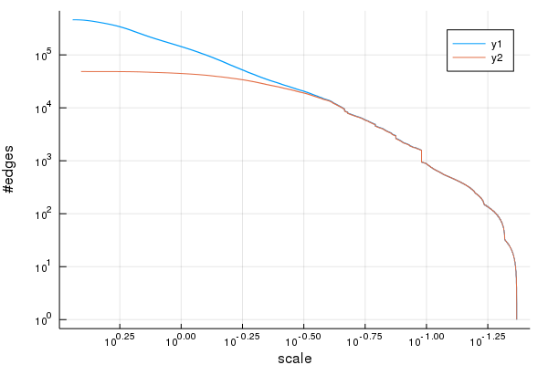


We see that we mostly removed very long edges. The y-axis is log-scale.


```julia
tinyz2_75_time_d1 = @elapsed @time runrips(edges_tiny_75; dim = 1);
tinyz2_75_time_d2 = @elapsed @time tinypers_z2d2_75 = runrips(edges_tiny_75; dim = 2);
@show length.(tinypers_z2d2_75.bars), tinypers_z2d2_75.dimscomplete;
```

      1.397108 seconds (694.79 k allocations: 19.434 MiB, 0.31% gc time)
      3.008985 seconds (698.22 k allocations: 19.574 MiB, 0.12% gc time)
    (length.(tinypers_z2d2_75.bars), tinypers_z2d2_75.dimscomplete) = ([960, 1022, 89], 3)


We observe a significant speed-up for the 1-dimensional and 2-dimensional computation:


```julia
@show tinyz2full_time_d1/tinyz2_75_time_d1 , tinyz2full_time_d2/tinyz2_75_time_d2;
```

    (tinyz2full_time_d1 / tinyz2_75_time_d1, tinyz2full_time_d2 / tinyz2_75_time_d2) = (20.806789998814633, 68.08747867316512)


Let us look at the resulting plot and explain how to interpret it:


```julia
plotpers(tinypers_z2d2_75; filter=nothing, logscale=true)[2]
```


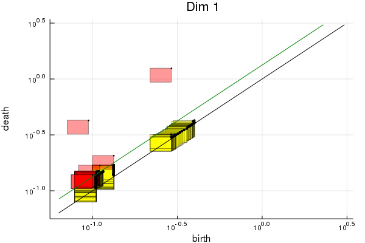


We are permitted to make an error for both birth and death. Every homology class has a two-dimensional error-bar, i.e. a rectangle, and its true lifetime must lie inside.

For some homology classes, the lower right corner of the error bar is below the diagonal. This means that our computed homology class may be an artifact of the approximation. These rectangles are marked in yellow. Computed approximate homology classes that are guaranteed to correspond to true homology classes are instead marked in red.

Some true homology classes may fail to show up in our approximate diagram. These are all guaranteed to lie below the green line. In other words, the green line demarks the unknown, where our computation is insufficient to provide any upper bound on topology.


In order to visualize this relation, let's plot the errorbars together with the real persistence bars.


```julia
p=plotpers(tinypers_z2d2_75; filter=nothing, logscale=true, real_markersize = 0, maybe_markersize = 0)[2]
bs= [b for (b,d) in tinypers_z2d1.bars[2]]
ds= [d for (b,d) in tinypers_z2d1.bars[2]]
plot!(p, bs, ds; seriestype=:scatter, markersize=3.0, color=:blue)

```


We observe that the approximation appears to be, in practice, much better than indicated by the shaded region: The true lifetimes are very close to the upper right corners (which are the lifetimes for the sparsified complex). We have no good explanation for this phenomenon.

Users who do not care about guaranteed correctness may optimistically hope that the approximation is better than indicated. In cases where a single value instead of an interval must be used for further processing, it is better to take the upper right corner than the midpoints of the errorbar.

Alternatively, we can compare the numerical values:


```julia
sort(tinypers_z2d2_75.errbars[2]; by=t->t[1][2]/t[2][2])[1:7]
```


    7-element Array{Tuple{Tuple{Float64,Float64},Tuple{Float64,Float64}},1}:
     ((0.070993575, 0.0946581), (0.320832, 0.427776))                  
     ((0.21853350000000002, 0.291378), (0.9366375, 1.24885))           
     ((0.09999975, 0.133333), (0.15516449999999998, 0.206886))         
     ((0.08272425, 0.110299), (0.12711224999999998, 0.169483))         
     ((0.07858124999999999, 0.104775), (0.11228475000000002, 0.149713))
     ((0.07858124999999999, 0.104775), (0.11228475000000002, 0.149713))
     ((0.0788775, 0.10517), (0.11239199999999999, 0.149856))           


```julia
sort(tinypers_z2d1.bars[2]; by=t->t[1]/t[2])[1:7]
```


    7-element Array{Tuple{Float64,Float64},1}:
     (0.0946581, 0.40718)
     (0.291378, 1.18423) 
     (0.133333, 0.206886)
     (0.110299, 0.169483)
     (0.104775, 0.149713)
     (0.104775, 0.149713)
     (0.10517, 0.149856) 


This permits us to take more sample points and verify our initial story about the persistent homology of the twice-wound torus.


```julia
@time ct_medium = Ctree(mediumtorus)
@time edges_medium_75 = sparsify_ctree(ct_medium, 0.75f0, -1; strategy=APosteriori());
@show length(edges_medium_75.edges)/length(edges_medium_75.ct.nodes);
nn=length(edges_medium_75.ct.nodes)
@show length(edges_medium_75.edges)*2/(nn*(nn-1));
```

      0.003872 seconds (645 allocations: 223.391 KiB)
      1.310039 seconds (129 allocations: 93.944 MiB, 3.04% gc time)
    length(edges_medium_75.edges) / length((edges_medium_75.ct).nodes) = 67.55416666666666
    (length(edges_medium_75.edges) * 2) / (nn * (nn - 1)) = 0.03519362681253799


```julia
mediumz2_75_time_d1 = @elapsed @time Sparips.runrips(edges_medium_75; dim = 1);

mediumz2_75_time_d2 = @elapsed @time mediumpers_z2d2_75 = Sparips.runrips(edges_medium_75; dim = 2);
@show length.(mediumpers_z2d2_75.bars), mediumpers_z2d2_75.dimscomplete

mediumz3_75_time_d2 = @elapsed @time mediumpers_z3d2_75 = Sparips.runrips(edges_medium_75; dim = 2, modulus=3);
@show length.(mediumpers_z3d2_75.bars), mediumpers_z3d2_75.dimscomplete;
```

      8.697234 seconds (3.79 M allocations: 102.999 MiB, 1.19% gc time)
     32.114522 seconds (3.80 M allocations: 103.377 MiB, 0.05% gc time)
    (length.(mediumpers_z2d2_75.bars), mediumpers_z2d2_75.dimscomplete) = ([3840, 3892, 411], 3)
     33.373266 seconds (3.80 M allocations: 103.410 MiB, 0.04% gc time)
    (length.(mediumpers_z3d2_75.bars), mediumpers_z3d2_75.dimscomplete) = ([3840, 3892, 411], 3)


When plotting this, we decide to filter out classes that are too close to the diagonal. This has the effect of moving the green line up, but leads to less cluttered diagrams.


```julia
mediumpers_z2_plts = Sparips.plotpers(mediumpers_z2d2_75; logscale=true, filter=0.9);
mediumpers_z3_plts = Sparips.plotpers(mediumpers_z3d2_75; logscale=true, filter=0.9);
p1=mediumpers_z2_plts[2]
p2=mediumpers_z3_plts[2]
p3=mediumpers_z3_plts[3]
p4=mediumpers_z3_plts[3]
title!(p1, "Z2d1")
title!(p2, "Z3d1")
title!(p3, "Z2d2")
title!(p4, "Z3d2");
p3
```


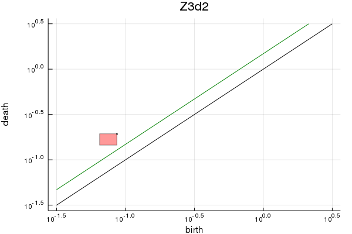


## Affine Cutoff
In reality, we will never be handed a nice, evenly spaced grid of sample points on a manifold. We further see that we can still only use a limited number of sample points, despite of sparsification.

If we have more sample points than we can use, then we should select the right subset and remember that this bounds the precision we can achieve, due to subsampling error.


```julia
@time ct_large = Ctree(largetorus);
@show length(largetorus);
```

      0.264379 seconds (18.27 k allocations: 5.787 MiB, 2.27% gc time)
    length(largetorus) = 100000


Now we have constructed the underlying contraction tree for our larger dataset. This construction takes asymptotic `O(N log(N))` evaluations of the metric, as long as the underlying space has bounded intrinsic dimension. In principle, there are large possible gains in speed by using faster construction algorithms; in practive, the time spent on building the tree does not matter compared to later operations.

The contraction tree allows us to obtain relatively evenly spaced subsamples by taking truncations. Let us plot how many points we need for desired errors `err` such that `d(x, project(x))<err` for all points `x`:


```julia
rs = [ct_large.nodes[ct_large.ibo[i]].r for i=2:length(ct_large.nodes)]
p=plot(rs, 1:(length(ct_large.nodes)-1); xlabel="err", ylabel="N", 
    xaxis=:log, yaxis=:log, xflip=true, fmt=:png)
```


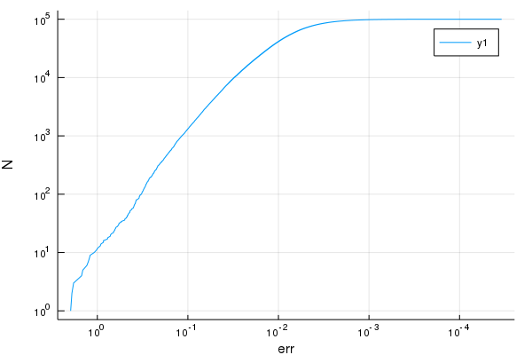


We observe that we need `~err^(-2)` points, which is the defining property of a "two-dimensional" finite metric space. We can also compute how close points are to each other. This is quadratic, so we restrict outselves to the start of this function:


```julia
function measure_separation(ct, nmax)
    ft=typeof(ct.nodes[1].r)
    r_lower = Vector{ft}(undef, nmax)
    dmin = ft(Inf) 
    for i=2:nmax
       
        pt = ct.data[ct.ibo[i]]
        for j=1:(i-1)
            d = evaluate(ct.dist, pt, ct.data[ct.ibo[j]])
            dmin = min(dmin, d)
        end
        r_lower[i]=dmin
    end
    popfirst!(r_lower)
    r_lower
end
@time r_lower = measure_separation(ct_large, 10_000);
```

      0.591870 seconds (63.00 k allocations: 3.268 MiB)


```julia
@show rs[1000], r_lower[1000], rs[1000]/r_lower[1000]
plot!(p,r_lower, 1:length(r_lower))
```

    (rs[1000], r_lower[1000], rs[1000] / r_lower[1000]) = (0.11680912f0, 0.042349637f0, 2.7582083f0)


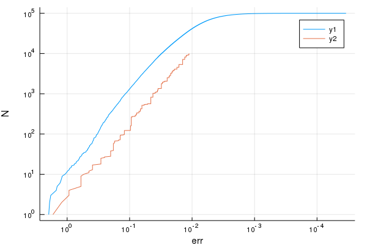


What we therefore see is that each truncation gives a relatively evenly spaced subsample: All remaining points have distance `<r1` to the subsample, and all taken points have pairwise distance `>r2`. We guarantee that the quotient `r1/r2 <= 4`, but it is often slightly better in practice.

We can now construct edges on the truncated set. We offer three strategies for this:


```julia
N = 4000;
@time edges_apriori_75 = sparsify_ctree(ct_large, 0.75f0, N, strategy=APriori())
@show length(edges_apriori_75.edges), length(edges_apriori_75.edges)/N

@time edges_semiaposteriori_75 = sparsify_ctree(ct_large, 0.75f0, N, strategy=SemiAPosteriori())
@show length(edges_semiaposteriori_75.edges), length(edges_semiaposteriori_75.edges)/N

@time edges_aposteriori_75 = sparsify_ctree(ct_large, 0.75f0, N, strategy=APosteriori())
@show length(edges_aposteriori_75.edges) , length(edges_aposteriori_75.edges)/N;
```

      0.211825 seconds (32 allocations: 13.501 MiB, 2.21% gc time)
    (length(edges_apriori_75.edges), length(edges_apriori_75.edges) / N) = (967177, 241.79425)
     10.571452 seconds (635.98 k allocations: 587.104 MiB, 2.46% gc time)
    (length(edges_semiaposteriori_75.edges), length(edges_semiaposteriori_75.edges) / N) = (733994, 183.4985)
     20.757407 seconds (147 allocations: 576.356 MiB, 1.05% gc time)
    (length(edges_aposteriori_75.edges), length(edges_aposteriori_75.edges) / N) = (601366, 150.3415)


The `APriori()` strategy is described in `https://arxiv.org/abs/1807.09982`. It scales only in the number `Nmax` of actually taken sample points, and is therefore much faster than the other strategies.

The `SemiAPosteriori()` strategy uses the apriori computed contraction times as in `https://arxiv.org/abs/1807.09982`, but removes further edges that could have been relevant (according to the triangle inequality) but are not actually relevant (when considering the actual distances and actual points below the cut `N`). This necessitates a descent into the tree.

The `APosteriori()` strategy computes contraction times according to the edges necessary to obtain the desired precision. The triangle inequality is used only to speed up nearest neighbor searches.

The first two strategies have the desireable property that edge construction and cutoff commute. By this we mean the following:


```julia
N = 2000;
@time edges_apriori_75_s = sparsify_ctree(ct_large, 0.75f0, N, strategy=APriori())
@time edges_semiaposteriori_75_s = sparsify_ctree(ct_large, 0.75f0, N, strategy=SemiAPosteriori())
@time edges_aposteriori_75_s = sparsify_ctree(ct_large, 0.75f0, N, strategy=APosteriori());
```

      0.101027 seconds (31 allocations: 7.501 MiB)
      6.373446 seconds (119 allocations: 357.853 MiB)
     16.091684 seconds (138 allocations: 368.733 MiB, 0.68% gc time)


```julia
k = searchsortedlast(edges_apriori_75.edges, (2000, 2000, Inf))
@show edges_apriori_75.edges[1:k] == edges_apriori_75_s.edges

k = searchsortedlast(edges_semiaposteriori_75.edges, (2000, 2000, Inf))
@show edges_semiaposteriori_75.edges[1:k] == edges_semiaposteriori_75_s.edges

k = searchsortedlast(edges_aposteriori_75.edges, (2000, 2000, Inf))
@show edges_aposteriori_75.edges[1:k] == edges_aposteriori_75_s.edges
@show issubset(edges_aposteriori_75_s.edges, edges_aposteriori_75.edges[1:k]);
```

    edges_apriori_75.edges[1:k] == edges_apriori_75_s.edges = true
    edges_semiaposteriori_75.edges[1:k] == edges_semiaposteriori_75_s.edges = true
    edges_aposteriori_75.edges[1:k] == edges_aposteriori_75_s.edges = false
    issubset(edges_aposteriori_75_s.edges, edges_aposteriori_75.edges[1:k]) = true


The difference in achieved sparsification becomes less pronounced for higher relative precision.


```julia
N = 4000;
for prec in [0.5f0, 0.75f0, 0.85f0]
    @show N,prec
    @time edges_apriori = sparsify_ctree(ct_large, prec, N, strategy=APriori())
    @show length(edges_apriori.edges), length(edges_apriori.edges)/N

    @time edges_semiaposteriori = sparsify_ctree(ct_large, prec, N, strategy=SemiAPosteriori())
    @show length(edges_semiaposteriori.edges), length(edges_semiaposteriori.edges)/N

    @time edges_aposteriori = sparsify_ctree(ct_large, prec, N, strategy=APosteriori())
    @show length(edges_aposteriori.edges) , length(edges_aposteriori.edges)/N;
end
```

    (N, prec) = (4000, 0.5f0)
      0.063186 seconds (23 allocations: 7.501 MiB)
    (length(edges_apriori.edges), length(edges_apriori.edges) / N) = (292824, 73.206)
      5.327144 seconds (104 allocations: 182.796 MiB)
    (length(edges_semiaposteriori.edges), length(edges_semiaposteriori.edges) / N) = (132806, 33.2015)
      6.845235 seconds (121 allocations: 187.625 MiB)
    (length(edges_aposteriori.edges), length(edges_aposteriori.edges) / N) = (107865, 26.96625)
    (N, prec) = (4000, 0.75f0)
      0.208710 seconds (24 allocations: 13.501 MiB)
    (length(edges_apriori.edges), length(edges_apriori.edges) / N) = (967177, 241.79425)
     10.136861 seconds (119 allocations: 555.906 MiB, 2.57% gc time)
    (length(edges_semiaposteriori.edges), length(edges_semiaposteriori.edges) / N) = (733994, 183.4985)
     21.401482 seconds (139 allocations: 576.356 MiB, 1.06% gc time)
    (length(edges_aposteriori.edges), length(edges_aposteriori.edges) / N) = (601366, 150.3415)
    (N, prec) = (4000, 0.85f0)
      0.565793 seconds (26 allocations: 49.501 MiB)
    (length(edges_apriori.edges), length(edges_apriori.edges) / N) = (2280935, 570.23375)
     18.236273 seconds (130 allocations: 1.122 GiB, 2.46% gc time)
    (length(edges_semiaposteriori.edges), length(edges_semiaposteriori.edges) / N) = (1974655, 493.66375)
     44.196319 seconds (151 allocations: 1.155 GiB, 0.51% gc time)
    (length(edges_aposteriori.edges), length(edges_aposteriori.edges) / N) = (1638779, 409.69475)


Let us now look at some results and the shape of the resulting precision function.


```julia
@time pers = runrips(edges_aposteriori_75; dim=1, modulus=2);
@show length.(pers.bars), pers.dimscomplete
```

     24.083913 seconds (8.50 M allocations: 226.986 MiB)
    (length.(pers.bars), pers.dimscomplete) = ([4000, 1935], 2)


    ([4000, 1935], 2)


```julia
plotpers(pers; logscale=false, filter=nothing)[2]
```


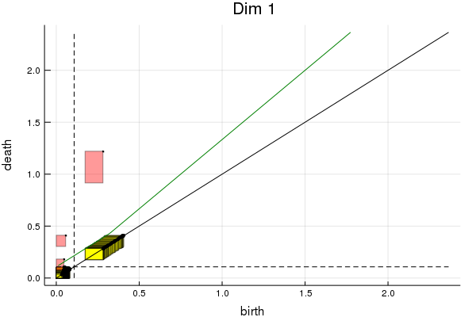


We have marked the absolute precision with the dashed line. We see that the green line is piecewise linear: The error is the maximum of the prescribed relative error (independent of the cutoff of the number of samples) and the subsampling error (which depends on the cutoff number of samples). In log coordinates:


```julia
plotpers(pers; logscale=true, filter=nothing)[2]
```


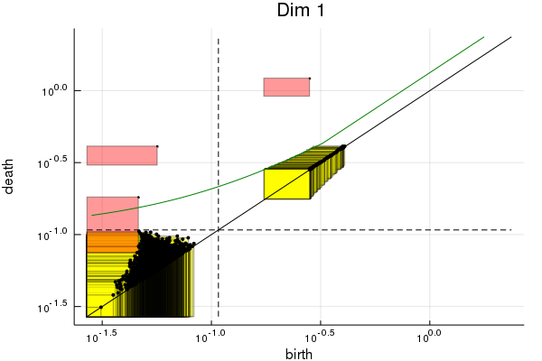


We see that a signigicant number of homology classes are plain garbage: If the class dies below the dashed line, then it is entirely uninformative, and just clutters the diagram. The `filter` argument filters out these bogus classes. The default is `filter=1.0` which just filters the bogus classes; the informational content of the diagram is unchanged.
Classes that are born to the left of the dashed line are possibly starting from `r=0`.


```julia
plotpers(pers; logscale=true, filter=1.0)[2]
```


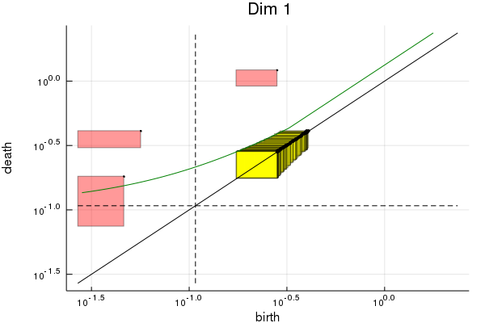


We see that this diagram is still clutttered by many classes that are close to the diagonal. For this reason, it is useful to set a larger filter. This will not change the size of rectangles, but it will move the green line up: We have already dropped all yellow rectangles whose upper left corner is below the green line. We will now drop some more, which means that we lose upper bounds on persistent homology in some regions.


```julia
plotpers(pers; logscale=true, filter=0.95)[2]
```


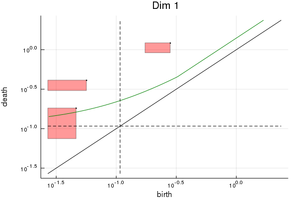


This massive filtering due to the error estimates can be viewed as a feature. We have a pretty good chance that the diagram has stabilized for `N->Inf`. That is, if we fix the cutoff `N_used=4000` and precision `0.75f0` and let the number of available samples `N_samples=100_000` tend to infinity, then the resulting collection of edges is guaranteed to stabilize; and it will correctly approximate the true support of the distribution, i.e. the torus, with the plotted error bars and green line. If our actual interest is in the uncountably large but compact torus and not in the paltry finite metric space of `4000` points, then we should filter and be happy.

Of course we have no way of proving whether we are already close to saturation. If our sample points are drawn independently from a distribution, then a good heuristic is to keep at most `~1/log(N)` many.

## What not to do
We warn now against an easy mistake to make: A naive person could take the most significant 4000 points, drop all others and compute the sparsification:


```julia
pts_rel = ct_large.data[ct_large.ibo[1:4000]];
ct_wrong = Ctree(pts_rel)
@time edges_wrong = sparsify_ctree(ct_wrong, 0.75f0, -1, strategy=APosteriori())
@show length(edges_wrong.edges) , length(edges_wrong.edges)/4000;
@time pers_wrong = runrips(edges_wrong; dim=1, modulus=2);
@show length.(pers_wrong.bars), pers_wrong.dimscomplete;
```

      0.976814 seconds (132 allocations: 96.962 MiB)
    (length(edges_wrong.edges), length(edges_wrong.edges) / 4000) = (299131, 74.78275)
      9.074711 seconds (4.30 M allocations: 116.077 MiB)
    (length.(pers_wrong.bars), pers_wrong.dimscomplete) = ([4000, 1998], 2)


```julia
plotpers(pers_wrong; logscale=true)[2]
```


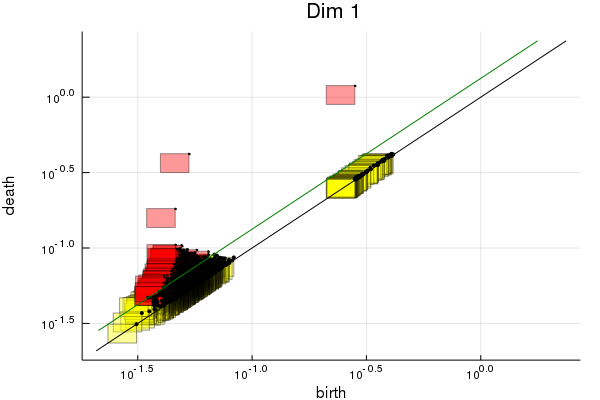


We immediately see that the result is utterly wrong. In order to fix this, we need to correct the error function.


```julia
struct prec_wrong_{fT} <: Sparips.AbstractPrecision
    eps_abs::fT
    eps_rel::fT
    Rmax::fT
end
Sparips.eval_down(p::prec_wrong_, r::fT) where fT = fT( p.eps_rel*(r-p.eps_abs) )
prec = prec_wrong_(pers.prec.eps_abs, 0.75f0, pers.prec.Rmax)
pers_corrected = Sparips.pers_diagram(pers_wrong.bars, prec, 
    Sparips.apply_prec(prec, pers_wrong.bars), pers_wrong.dimscomplete);
plotpers(pers_corrected, logscale=true; filter=0.95)[2]

```


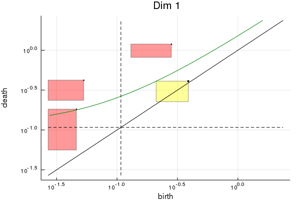


```julia
plotpers(pers_corrected, logscale=false)[2]

```


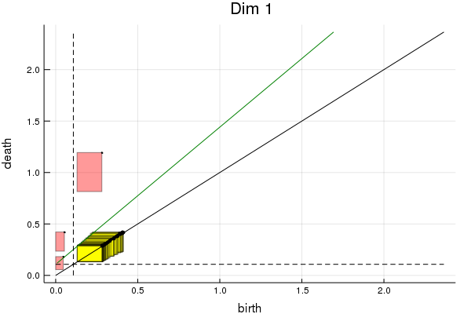


In other words: The cutoff provided by `Sparips.jl` leads to piecewise-affine error estimates, while the naive cutoff leads to affine-linear error estimates.

## Custom metrics and precisions
There are several places to change defaults. First, we can use different distance functions. See `Distances.jl` for an extensive documentaion; we give a small example here:


```julia
using Distances
struct L1dist_<:Distances.Metric end
Distances.evaluate(::L1dist_, x,y) = sum(abs, x-y)
ct = Ctree(shuffle(tinytorus), dist=L1dist_());

```

Second, we can prescribe more compicated desired precisions. It is always assumed that `eval_down(prec, r) <= r`, and that the functions `t->eval_down(prec, t)` and `t->t-eval_down(prec, t)` are monotone increasing. If one of these assumptions is violated, then `Sparips.jl` will produce wrong results. Let us give a quick example:
    


```julia
struct prec_<:Sparips.AbstractPrecision end
function Sparips.eval_down(::prec_, r::fT) where fT
   r <= 0 && return zero(fT)
   r>= 1 && return 0.75f0*r
   return fT(min(0.75f0*r, -r/log2(r)))
end
```


```julia
@time edges = sparsify_ctree(ct_large, prec_(), 8000, strategy=APosteriori())
@show length(edges.edges), length(edges.edges)/N;

```

     20.719144 seconds (416.14 k allocations: 596.402 MiB)
    (length(edges.edges), length(edges.edges) / N) = (558162, 139.5405)


```julia
@time pers = runrips(edges; dim=1, modulus=2);
@show length.(pers.bars), pers.dimscomplete;
```

     22.661125 seconds (8.22 M allocations: 225.213 MiB, 1.46% gc time)
    (length.(pers.bars), pers.dimscomplete) = ([8000, 3778], 2)


```julia
plotpers(pers, logscale=false, filter=0.95)[2]

```


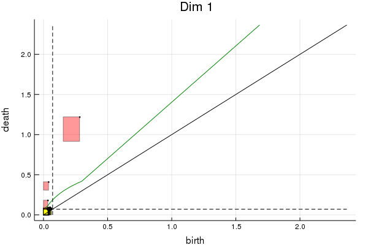


```julia
plotpers(pers, logscale=true, filter=0.95)[2]

```


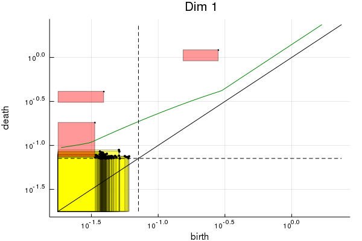


## Example: Solenoid
The initial generation of data already hinted at the solenoid behind this. If we wind the torus around the axis again and again, we end up with a fractal called solenoid. The dimension of the solenoid is a real number between `1` and `2`. We shall now look at the solenoid, for two reasons: First, it is an example with interesting persistent homology. Second, it emphasizes the relevance of the intrinsic dimension of the data.


```julia
function regular_solenoid(nmall, nlarge, numiters)
    res = Vector{SVector{3, Float32}}();
    for phi in range(0.0, stop=1.0*(nlarge-1)/nlarge, length=nlarge)
        for psi in range(0.0, stop=2*pi*(nmall-1)/nmall, length=nmall)
            x= 0.4*cos(psi)
            y= 0.4*sin(psi)
            push!(res, sample_solenoid(phi, x, y , numiters)) 
        end
    end
    res
end
regsol = regular_solenoid(3, 4_000, 7);
largesol = gensolenoid(300_000, 24);

```


```julia
datamat=reshape(reinterpret(Float32, regsol), (3,length(regsol)));
p1= plot(datamat[1,:], datamat[2,:], datamat[3,:]; seriestype=:path, 
    legend=false);
p2=plot(datamat[1,:], datamat[2,:]; seriestype=:path,
    legend=false, xlabel="x", ylabel="y");
p3=plot(datamat[1,:], datamat[3,:]; seriestype=:path,
    legend=false, xlabel="x", ylabel="z");
plot(p1,p2,p3; fmt=:png)
```


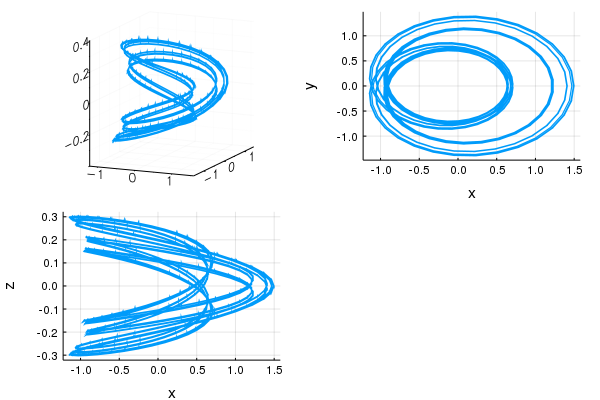


```julia
@time ctsol = Ctree(largesol);
```

      0.755714 seconds (57.43 k allocations: 17.549 MiB)


```julia
N=4_000
@time edges = sparsify_ctree(ctsol, 0.65f0, N, strategy=APosteriori());
@show length(edges.edges), length(edges.edges)/N;
@time pers = runrips(edges);
@show length.(pers.bars), pers.dimscomplete;
plotpers(pers; logscale=true, filter=0.9)[2]
```

     11.731795 seconds (128 allocations: 183.813 MiB)
    (length(edges.edges), length(edges.edges) / N) = (107939, 26.98475)
      3.046139 seconds (1.69 M allocations: 46.591 MiB)
    (length.(pers.bars), pers.dimscomplete) = ([4000, 1374], 2)


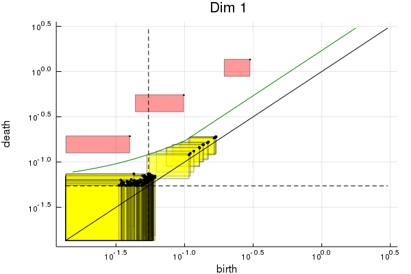


```julia
@time pers = runrips(edges; modulus = 3);
@show length.(pers.bars), pers.dimscomplete;
plotpers(pers; logscale=true, filter=0.9)[2]
```

      3.228409 seconds (1.70 M allocations: 47.135 MiB)
    (length.(pers.bars), pers.dimscomplete) = ([4000, 1374], 2)


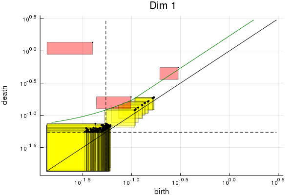


```julia
N=64_000
@time edges = sparsify_ctree(ctsol, 0.65f0, N, strategy=APosteriori());
@show length(edges.edges), length(edges.edges)/N;
@time pers = runrips(edges);
@show length.(pers.bars), pers.dimscomplete;
plotpers(pers; logscale=true, filter=0.9)[2]
```

     24.926792 seconds (157 allocations: 704.773 MiB)
    (length(edges.edges), length(edges.edges) / N) = (1340224, 20.941)
     47.473168 seconds (24.02 M allocations: 650.155 MiB, 1.01% gc time)
    (length.(pers.bars), pers.dimscomplete) = ([64000, 21437], 2)


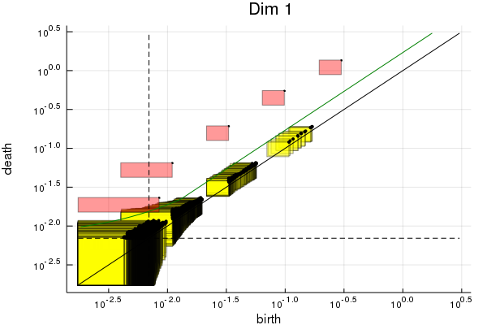


```julia
@time pers = runrips(edges; modulus = 3);
@show length.(pers.bars), pers.dimscomplete;
plotpers(pers; logscale=true, filter=0.9)[2]
```

     49.715154 seconds (24.06 M allocations: 650.761 MiB, 0.23% gc time)
    (length.(pers.bars), pers.dimscomplete) = ([64000, 21437], 2)


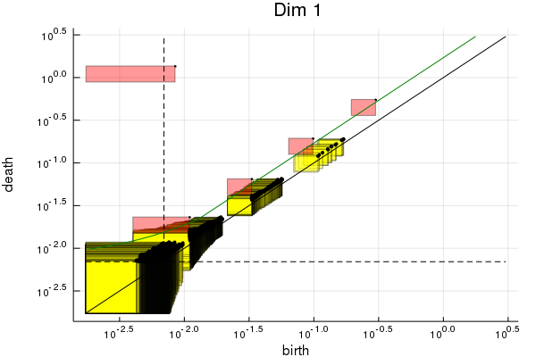


We see that, using sparsification and relative errors, we can compute persistence diagrams that span many orders of magnitude.

## Using the output and summary
Most uses of persistent homology will combine interactive exploration of some representative datasets with a pipeline for automatic quantitative processing of a batch of datasets. We have now seen the interactive exploration, and how to tweak sparsification parameters until the problem becomes computationally feasible.

Let us now quickly explain the output of `runrips`, and summarize some usage tips.

The output has type `pers_diagram`, with the fields `bars`, `prec`, `errbars` and `dimscomplete`.

`prec` is the precision of the computation. `bars` is a vector of vectors of `(birth, death)` tuples, signifying homology classes. `errbars` contains essentially the same information, already prepared as tuples `((birth_earliest, birth_latest), (death_earliest, death_latest))`. Typically, `birth=birth_latest` and `birth_earliest = eval_down(prec, birth)` (up to certain special cases for truncation).

In cases where the postprocessing pipeline is incapable of using the precision information, it is advisable to use `(birth, death)` and _not_ midpoints `(birth_earliest+birth_latest)/2`. This is bourne by the experience that these are typically better approximations than the midpoints, even though we have no proper mathematical explanation of this phenomenon.

If many datapoints are available, then it is advisable to use all of them and let `Sparips.jl` handle the truncation. If we model points as independently sampled from a distribution, then it is advisable to let `Sparips.jl` truncate the dataset down to a small fraction of its original size. This will both speed up computations, and allow us to use the error bounds from `Sparips.jl` as an heuristic estimate for the sampling error incurred by considering only finitely many points, instead of an infinite dataset sampled from the same distribution.

Sparsification improves the complexity class of the computation of persistent homology, for metric spaces of bounded dimension. This allows us to move from tiny to merely small data. Nevertheless, we are still far away from "big data" or even "medium data".

The primary contraints on computations are available random access memory and internal limitations of `ripser`. Due to the implementation and algorithm used by `ripser`, swapping is harmful and should be avoided, at the cost of having `ripser` crash with out-of-memory errors.

In most cases, the cost for sparsification is dwarfed by the cost of running `ripser`. In these cases, the `APosteriori` strategy is a good trade-off. It would be nice to have faster algorithms for the `APosteriori` sparsification, but we currently don't have them. Even if we could speed up the sparse edge construction, we would probably spend all these saved cycles to shave off a further handful of edges, anyway.


